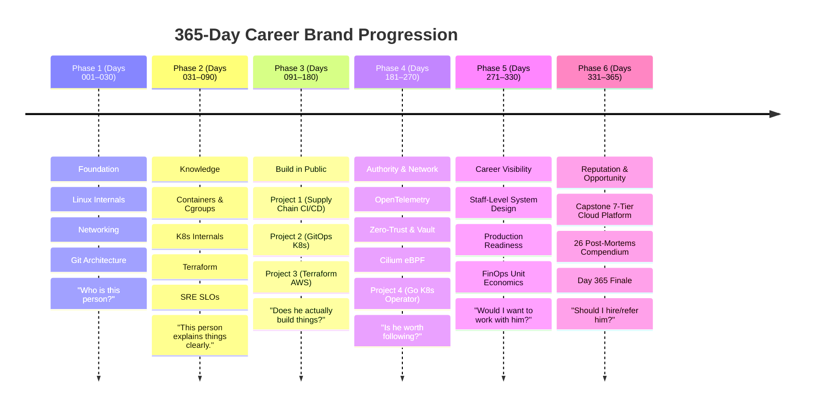

# 365-Day Cloud & DevOps Personal Brand + Career Growth System

[](https://shubhu-io.github.io/daily-devops-365/)
[](https://github.com/shubhu-io/daily-devops-365)

### 🔗 [**Launch Carousel Studio →**](https://shubhu-io.github.io/daily-devops-365/)

> **"Don't try to make me famous. Make me useful."**  
> *A production-grade, 365-day technical personal branding, community-building, and inbound career engineering system in Cloud Infrastructure, DevOps, SRE, and Platform Engineering.*

---

## 1. Executive Summary

This repository contains the complete, battle-tested operational system for transforming an engineer from an unverified practitioner into an authoritative, highly sought-after industry voice over 365 continuous days.

Every single day is engineered around a core value flywheel:

$$\text{Learn} \longrightarrow \text{Build} \longrightarrow \text{Document} \longrightarrow \text{Explain} \longrightarrow \text{Help} \longrightarrow \text{Connect} \longrightarrow \text{Build Credibility} \longrightarrow \text{Attract Inbound}$$

### Strict Anti-Slop Principles
- ❌ **Zero Generic Motivational Fluff:** No "5 Morning Habits of 10x Engineers" or hustle porn.
- ❌ **Zero Job Begging:** No "Open to Work / Please hire me / Looking for referrals" desperation posts.
- ❌ **Zero Engagement Bait:** No "Agree? Like if you code in dark mode" algorithmic trickery.
- ❌ **Zero Recycled Content:** No reposted infographics or uncredited screenshots.
- ✅ **100% Real Knowledge & Proof of Work:** Production configurations, kernel internals, 26 blameless incident post-mortems, and 4 functional open-source systems.

---

## 2. Repository Architecture & Directory Map

```text
Daily post/
├── README.md                           # Master Executive Dashboard (This Document)
├── MASTER_INDEX.md                     # 365-Day Searchable Catalog & Cross-Reference
│
├── 00_SYSTEM_STRATEGY/                 # Core Brand, Profile & Inbound Engine Suite
│   ├── 01_MASTER_BRAND_STRATEGY.md     # Positioning, Flywheel, 10 Pillars & Voice
│   ├── 02_PROFILE_OPTIMIZATION_SUITE.md# LinkedIn, GitHub & Portfolio Blueprint
│   ├── 03_NETWORKING_PLAYBOOK.md       # High-Signal Networking & Value-Add Commenting
│   ├── 04_RECRUITER_ATTRACTOR_ENGINE.md# Inbound Conversion & Salary Negotiation
│   ├── 05_CAROUSEL_&_VIDEO_TEMPLATES.md# 9-Slide Carousel & 60-Sec Short-Video Frameworks
│   ├── 06_CONTENT_REPURPOSING_MATRIX.md# 1 Post -> LinkedIn, X, GitHub, Video & Blog
│   └── 07_METRICS_&_REVIEW_SYSTEMS.md  # KPI Tracking, 30/90/180/365-Day Reviews
│
├── 01_PHASE_1_FOUNDATION/              # Days 001–030: Setting the Technical Baseline
│   ├── README.md                       # Phase 1 Strategy, Curriculum & Milestones
│   ├── Week_01_Days_001_007.md         # Linux Core OS, Inodes, File Descriptors, Grep/Awk
│   ├── Week_02_Days_008_014.md         # Process Lifecycle, Memory/Swap/OOM, TCP 3-Way Handshake
│   ├── Week_03_Days_015_021.md         # DNS, ss/tcpdump, TLS Handshake, Git Object Graph
│   └── Week_04_Days_022_030.md         # SSH Hardening, Bash strict mode, Rsync, Linux Diagnostics
│
├── 02_PHASE_2_KNOWLEDGE/               # Days 031–090: Core Infrastructure Mechanics
│   ├── README.md                       # Phase 2 Strategy, Mechanics & Visual Systems
│   ├── Month_02_Days_031_060/          # Containers & Kubernetes Primitives
│   │   ├── Week_05_Days_031_037.md     # Namespaces/Cgroups, OverlayFS, Multi-stage Builds
│   │   ├── Week_06_Days_038_045.md     # K8s Control Plane, Pods, Services, iptables/IPVS
│   │   ├── Week_07_Days_046_052.md     # Ingress, StorageClasses, Health Probes, CFS Throttling
│   │   └── Week_08_Days_053_060.md     # RBAC, DaemonSets, Helm vs Kustomize, Terraform Core
│   └── Month_03_Days_061_090/          # Terraform, AWS Networking & Observability
│       ├── Week_09_Days_061_067.md     # S3 Remote State Locks, DAG Graph, Multi-AZ VPC
│       ├── Week_10_Days_068_075.md     # NAT Gateways, Security Groups vs NACLs, IAM STS
│       ├── Week_11_Days_076_082.md     # GitHub Actions, Deployment Strategies, ArgoCD GitOps
│       └── Week_12_Days_083_090.md     # Prometheus PromQL, Grafana Golden Signals, SRE SLOs
│
├── 03_PHASE_3_BUILD_IN_PUBLIC/         # Days 091–180: 3 Flagship Open-Source Projects
│   ├── README.md                       # Phase 3 Project Blueprints & Repository Architecture
│   ├── Month_04_Days_091_120.md        # Project 1: Enterprise Supply Chain CI/CD (Post-Mortems 01-03)
│   ├── Month_05_Days_121_150.md        # Project 2: Multi-Tenant GitOps Platform (Post-Mortems 04-06)
│   └── Month_06_Days_151_180.md        # Project 3: Modular Terraform AWS Platform (Post-Mortems 07-09)
│
├── 04_PHASE_4_AUTHORITY_NETWORK/       # Days 181–270: Advanced Systems & Platform Engineering
│   ├── README.md                       # Phase 4 Advanced Architecture & Network Authority
│   ├── Month_07_Days_181_210.md        # SRE Observability: OTel, High Cardinality, Raft (Post-Mortems 10-12)
│   ├── Month_08_Days_211_240.md        # DevSecOps: Vault Dynamic Secrets, Falco, STRIDE (Post-Mortems 13-15)
│   └── Month_09_Days_241_270.md        # eBPF Cilium, Istio Mesh, Go Custom Operator (Post-Mortems 16-18)
│
├── 05_PHASE_5_CAREER_VISIBILITY/       # Days 271–330: Staff-Level System Design & Inbound
│   ├── README.md                       # Phase 5 Staff Systems, Production Readiness & FinOps
│   ├── Month_10_Days_271_300.md        # High-Availability System Design & Interviews (Post-Mortems 19-21)
│   └── Month_11_Days_301_330.md        # Production Readiness Reviews & Inbound Engine (Post-Mortems 22-24)
│
└── 06_PHASE_6_REPUTATION_OPPORTUNITY/  # Days 331–365: Capstone Blueprint & Opportunity Conversion
    ├── README.md                       # Phase 6 Capstone Platform & Retrospective Suite
    └── Days_331_365.md                 # 7-Tier Blueprint, 26 Post-Mortems, Day 365 Finale (Post-Mortems 25-26)
```

---

## 3. The 6 Phased Milestones



---

## 4. The 4 Flagship Projects & Capstone Platform

Every engineer seeking high-compensation senior roles must demonstrate verifiable code and production architectural proof. This system establishes four public GitHub repositories and one unified enterprise blueprint:

1. **Flagship Project 1: Zero-Trust Secure Supply Chain & CI/CD Platform (Days 091–120)**
   - **Stack:** GitHub Actions, Cosign Keyless, Syft/Grype SBOM, Trivy, Kaniko In-Cluster Build, SLSA Level 3.
   - **Proof:** Immutable image digests, zero unauthenticated container runners, automated CVE gating.
   - **Reference:** [Month_04_Days_091_120.md](file:///d:/Codeing/Ai/antigravity/Daily%20post/03_PHASE_3_BUILD_IN_PUBLIC/Month_04_Days_091_120.md#day-091)

2. **Flagship Project 2: Enterprise Multi-Tenant GitOps Platform (Days 121–150)**
   - **Stack:** AWS EKS, ArgoCD App-of-Apps, Crossplane AWS Provider, Kyverno PSS Admission, External Secrets Operator.
   - **Proof:** Zero manual `kubectl apply`, automated canary deployments via Argo Rollouts, cluster backup via Velero.
   - **Reference:** [Month_05_Days_121_150.md](file:///d:/Codeing/Ai/antigravity/Daily%20post/03_PHASE_3_BUILD_IN_PUBLIC/Month_05_Days_121_150.md#day-121)

3. **Flagship Project 3: Production Modular AWS Infrastructure Suite (Days 151–180)**
   - **Stack:** Terraform 1.5+ / OpenTofu, Multi-AZ VPC, Transit Gateway Hub, EKS Node Groups, Terratest in Go.
   - **Proof:** Infracost FinOps PR estimation, Checkov/TFSec static analysis, automated `terraform-docs` pipeline.
   - **Reference:** [Month_06_Days_151_180.md](file:///d:/Codeing/Ai/antigravity/Daily%20post/03_PHASE_3_BUILD_IN_PUBLIC/Month_06_Days_151_180.md#day-151)

4. **Flagship Project 4: Custom Kubernetes Database Backup Operator in Go (Days 261–270)**
   - **Stack:** Go 1.22, Kubebuilder, Controller-Runtime, Custom Resource Definitions (CRDs), EnvTest.
   - **Proof:** Level-triggered reconciliation, finalizer-protected safe deletion, automated S3 database backups.
   - **Reference:** [Month_09_Days_241_270.md](file:///d:/Codeing/Ai/antigravity/Daily%20post/04_PHASE_4_AUTHORITY_NETWORK/Month_09_Days_241_270.md#day-261)

5. **Capstone: 7-Tier Enterprise Cloud Platform Blueprint (Days 331–365)**
   - **Architecture:** Multi-account AWS governance, zero-trust network fabric, high-performance EKS, Vault secrets engine, unified OTel/Thanos telemetry, Backstage internal developer portal, and FinOps automated anomaly defense.
   - **Reference:** [Days_331_365.md](file:///d:/Codeing/Ai/antigravity/Daily%20post/06_PHASE_6_REPUTATION_OPPORTUNITY/Days_331_365.md#day-331)

---

## 5. Master Incident Post-Mortem Compendium (26 Incidents)

Seniority is forged through failure and recovery. The strategy documents 26 comprehensive, blameless post-mortems covering the entire distributed systems stack:

| Post-Mortem | Day | Incident Focus | Root Cause |
|---|---|---|---|
| **PM 01** | Day 098 | Docker Build Cache Invalidation | Layer ordering invalidated dependency caching |
| **PM 02** | Day 107 | OOMKilled In-Cluster Kaniko Build | Uncapped container memory limits during Go compilation |
| **PM 03** | Day 114 | Expired Sigstore Leaf Certificate | Clock drift in local verification container |
| **PM 04** | Day 127 | ArgoCD Sync-Storm Cascading Throttling | K8s API server throttled 800 parallel CRD reconciliations |
| **PM 05** | Day 135 | GitOps Secret Decryption Deadlock | Evicted External Secrets Operator pod halted DB bootstrap |
| **PM 06** | Day 142 | Kyverno Mutating Webhook Timeout | `failurePolicy: Fail` blocked node rolling upgrade |
| **PM 07** | Day 157 | Terraform State Lock Deadlock | Orphaned DynamoDB lock string following runner termination |
| **PM 08** | Day 166 | EKS Subnet IP Exhaustion Outage | AWS VPC CNI allocated ENI secondaries until subnet emptied |
| **PM 09** | Day 173 | Unfiltered CloudWatch Logs $2,800 Spike | Blind debug log ingestion across 50 production worker nodes |
| **PM 10** | Day 188 | Prometheus Server Out-Of-Memory Crash | High cardinality `user_id` label injected into request counter |
| **PM 11** | Day 195 | OpenTelemetry Collector Silent Packet Drop | Unbuffered gRPC exports bottlenecked during network saturation |
| **PM 12** | Day 204 | Alert Fatigue Induced Production Blunder | 400 daily non-actionable Slack alerts masked real DB failover |
| **PM 13** | Day 218 | Vault Token Expiry Outage in Payment Engine| Unhandled panic in renewal goroutine caused token death |
| **PM 14** | Day 226 | Falco eBPF Kernel Probe Panic on Node Roll | Kernel header mismatch during automatic node AMI roll |
| **PM 15** | Day 233 | Base Image Vulnerability Enables Shell | Unpinned mutable Alpine tag inherited remote RCE CVE |
| **PM 16** | Day 248 | Cilium eBPF Conntrack Table Exhaustion | Conntrack table size exceeded during burst DDoS traffic |
| **PM 17** | Day 255 | Istio Sidecar Injection Infinite CrashLoop | Init-container iptables rules conflicted with host network |
| **PM 18** | Day 268 | Unbuffered Go Channel Leak in Operator | Abandoned goroutines consumed 100% controller RAM |
| **PM 19** | Day 278 | Split-Brain Disaster in Multi-AZ PostgreSQL | Network partition split replica election; dual writes occurred |
| **PM 20** | Day 285 | Redis Cache Stampede on Peak Sale Day | Synchronous TTL expiration swamped primary database pool |
| **PM 21** | Day 294 | RabbitMQ Network Partition Queue Deadlock | Unacknowledged messages exceeded RAM, freezing broker disk writes |
| **PM 22** | Day 308 | Thundering Herd in Microservices Restart | 150 pods booted simultaneously, swamping database connection pool |
| **PM 23** | Day 316 | Idle NAT Gateway $4,200 Misconfiguration | Cross-AZ traffic looped through public NAT Gateway instead of peering |
| **PM 24** | Day 325 | Stale Readiness Probe Dropping In-Flight Traffic | Pod SIGTERM arrived before endpoint slice removal |
| **PM 25** | Day 344 | Cascading Regional Failover Capacity Collapse | Failover traffic from us-east-1 saturated us-west-2 capacity |
| **PM 26** | Day 358 | The 365-Day Incident Retrospective Compendium | Cross-discipline synthesis across Linux, K8s, Storage & IAM |

*For complete incident timelines, root causes, mitigations, and architectural invariants, see [MASTER_INDEX.md](file:///d:/Codeing/Ai/antigravity/Daily%20post/MASTER_INDEX.md#3-master-incident-post-mortems-cross-reference-26-total).*

---

## 6. Daily 30-Minute Operating Rhythm

To maintain consistency without burnout, execute this structured 30-minute daily protocol:

```text
┌────────────────────────────────────────────────────────────────────────┐
│               DAILY 30-MINUTE EXECUTION WORKFLOW                       │
├───────────────┬────────────────────────────────────────────────────────┤
│ 00:00 - 05:00 │ Open today's markdown file in MASTER_INDEX.md.          │
│               │ Review the Hook, Body, Diagram Prompt, and CTA.        │
├───────────────┼────────────────────────────────────────────────────────┤
│ 05:00 - 10:00 │ Publish primary post to LinkedIn.                      │
│               │ Attach diagram / carousel PDF / code snippet.         │
│               │ Pin your own value-add discussion comment.             │
├───────────────┼────────────────────────────────────────────────────────┤
│ 10:00 - 15:00 │ Repurpose via Content Repurposing Matrix:              │
│               │ - Short insight thread on X / Twitter                  │
│               │ - Commit project code / update README on GitHub        │
├───────────────┼────────────────────────────────────────────────────────┤
│ 15:00 - 25:00 │ Execute Daily High-Signal Networking Action:           │
│               │ - Leave 3 thoughtful technical comments on peer posts  │
│               │ - Connect with 1 engineer or hiring manager            │
├───────────────┼────────────────────────────────────────────────────────┤
│ 25:00 - 30:00 │ Engage with inbound replies on your morning post.       │
│               │ Answer questions, acknowledge counter-arguments.       │
└───────────────┴────────────────────────────────────────────────────────┘
```

---

## 7. Master Strategy Suites (`00_SYSTEM_STRATEGY/`)

Review and internalize the 7 core strategic playbooks before launching Day 001:

1. [01_MASTER_BRAND_STRATEGY.md](file:///d:/Codeing/Ai/antigravity/Daily%20post/00_SYSTEM_STRATEGY/01_MASTER_BRAND_STRATEGY.md): Core positioning, audience stages, 10 content pillars, and authentic voice guidelines.
2. [02_PROFILE_OPTIMIZATION_SUITE.md](file:///d:/Codeing/Ai/antigravity/Daily%20post/00_SYSTEM_STRATEGY/02_PROFILE_OPTIMIZATION_SUITE.md): Complete copywriting, banner designs, and featured sections for LinkedIn, GitHub, and Portfolio.
3. [03_NETWORKING_PLAYBOOK.md](file:///d:/Codeing/Ai/antigravity/Daily%20post/00_SYSTEM_STRATEGY/03_NETWORKING_PLAYBOOK.md): The "Value-Add Commenting System", 5 high-signal comment templates, and relationship escalation protocols.
4. [04_RECRUITER_ATTRACTOR_ENGINE.md](file:///d:/Codeing/Ai/antigravity/Daily%20post/00_SYSTEM_STRATEGY/04_RECRUITER_ATTRACTOR_ENGINE.md): Reverse-engineering recruiter searches, screening inbound messages, and anchoring salary negotiation in business ROI.
5. [05_CAROUSEL_&_VIDEO_TEMPLATES.md](file:///d:/Codeing/Ai/antigravity/Daily%20post/05_CAROUSEL_&_VIDEO_TEMPLATES.md): Visual slide layouts, Canva/Figma color tokens, and 60-second technical short-video scripts.
6. [06_CONTENT_REPURPOSING_MATRIX.md](file:///d:/Codeing/Ai/antigravity/Daily%20post/00_SYSTEM_STRATEGY/06_CONTENT_REPURPOSING_MATRIX.md): Repurposing 1 core LinkedIn post into X threads, Instagram carousels, Dev.to articles, and GitHub commits.
7. [07_METRICS_&_REVIEW_SYSTEMS.md](file:///d:/Codeing/Ai/antigravity/Daily%20post/00_SYSTEM_STRATEGY/07_METRICS_&_REVIEW_SYSTEMS.md): Quality-over-vanity scorecard, weekly operating cadence, and formal 30/90/180/365-day audit rubrics.

---

## 8. Direct Phase Links

- 📁 **[Phase 1: Foundation (Days 001–030)](file:///d:/Codeing/Ai/antigravity/Daily%20post/01_PHASE_1_FOUNDATION/README.md)**
- 📁 **[Phase 2: Knowledge (Days 031–090)](file:///d:/Codeing/Ai/antigravity/Daily%20post/02_PHASE_2_KNOWLEDGE/README.md)**
- 📁 **[Phase 3: Build in Public (Days 091–180)](file:///d:/Codeing/Ai/antigravity/Daily%20post/03_PHASE_3_BUILD_IN_PUBLIC/README.md)**
- 📁 **[Phase 4: Authority & Network (Days 181–270)](file:///d:/Codeing/Ai/antigravity/Daily%20post/04_PHASE_4_AUTHORITY_NETWORK/README.md)**
- 📁 **[Phase 5: Career Visibility (Days 271–330)](file:///d:/Codeing/Ai/antigravity/Daily%20post/05_PHASE_5_CAREER_VISIBILITY/README.md)**
- 📁 **[Phase 6: Reputation & Opportunity (Days 331–365)](file:///d:/Codeing/Ai/antigravity/Daily%20post/06_PHASE_6_REPUTATION_OPPORTUNITY/README.md)**
- 📑 **[365-Day Master Content & Architecture Index](file:///d:/Codeing/Ai/antigravity/Daily%20post/MASTER_INDEX.md)**

---

*Every post is pre-written, verified for deep technical accuracy, and formatted for maximum visual and educational impact. Execute daily, stay consistent, and let your proof of work do the talking.*
